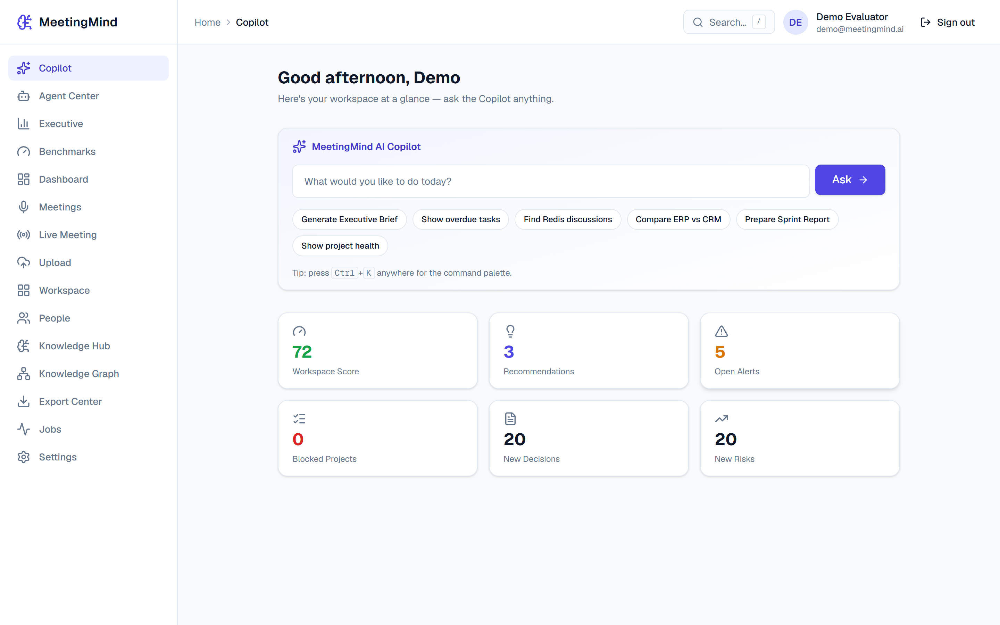
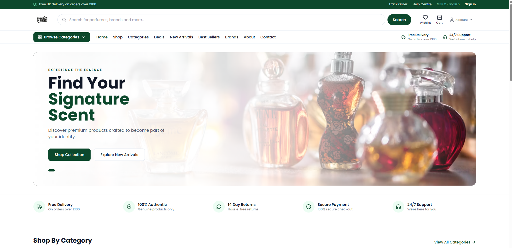
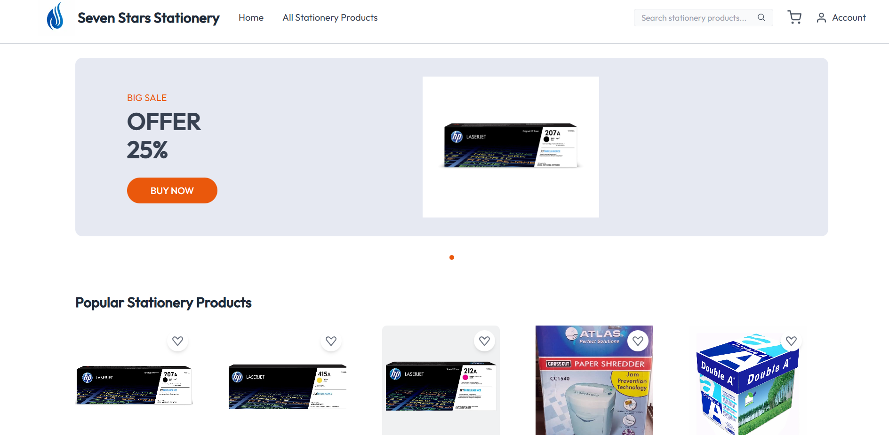

<div align="center">


# Hi, I'm Sridhar Mahalingam 👋


**I build software around constraints** — security, offline-first, real-time, multi-tenancy and self-hosted AI.


<br/>

[](https://sridharportfolio1.netlify.app)
[](mailto:sridharansridhar22@gmail.com)
[](https://www.linkedin.com/in/sridhar-mahalingam-6b8357245/)
[](https://www.instagram.com/ig_sd_sha)
[](https://sridharportfolio1.netlify.app/resume/Sridhar_Mahalingam_Resume.pdf)


</div>

---

## 🧭 About me

```console
$ whoami --verbose

NAME    Sridhar Mahalingam
ROLE    Full Stack Developer · Senior Backend Developer @ Holora Performance
FROM    Chennai, India
BASE    Doha, Qatar · transferable visa · NOC available
YEARS   3+ shipping production software end to end
SCOPE   security · ERPs · e-commerce · healthcare · mobile · self-hosted AI
ORIGIN  studied petrochemical engineering → fell in love with code
```

Full Stack Developer with 3+ years of experience building scalable web and mobile applications for **UK and Qatar clients** — modern responsive UIs, secure REST APIs, payment integrations, real-time systems, and Linux/cloud deployment. I've shipped **19 systems across 7 problem domains**, most of them alone, from the first database schema to the Nginx config on the server.

If a system depends on someone else's cloud, my first question is always — *does it have to?*

---

## 🛠️ Tech Stack

<table>
<tr>
<td width="50%" align="center">
<h3>💻 Languages</h3>

</td>
<td width="50%" align="center">
<h3>⚛️ Frontend</h3>

</td>
</tr>

<tr>
<td width="50%" align="center">
<h3>🧩 Backend</h3>

<br/><sub>Django REST Framework • Channels • Celery • WebSockets • JWT Auth</sub>
</td>
<td width="50%" align="center">
<h3>📱 Mobile & Desktop</h3>

<br/><sub>Flutter (Dart) • React Native • Jetpack Compose • Tauri (Rust)</sub>
</td>
</tr>

<tr>
<td width="50%" align="center">
<h3>🤖 AI / ML</h3>

<br/><sub>FCOS • ONNX Runtime • Faster-Whisper • Ollama • Tesseract OCR • RAG + pgvector — all self-hosted</sub>
</td>
<td width="50%" align="center">
<h3>🗄️ Databases</h3>

</td>
</tr>

<tr>
<td width="50%" align="center">
<h3>☁️ Cloud & Deployment</h3>

<br/><sub>Render • Contabo VPS • HTTPS/TLS</sub>
</td>
<td width="50%" align="center">
<h3>🔌 Tools & Integrations</h3>

<br/><sub>Stripe • AWS SES • Firebase Cloud Messaging • Google Maps</sub>
</td>
</tr>
</table>

---

<!-- PROJECTS:START -->

## 🚀 Flagship Systems

Six systems, six different problems — each organised around a genuinely different constraint.
<sub>Every card expands — click <b>📖 More about this system</b> for the problem, the key decision and the trade-off.</sub>

<table>
<tr>
<td width="50%" valign="top">

### 🛡️ ShieldDNS v2.0


<br/><sub><b>Security · Networking · Systems</b> · Sole developer — designed, built and released end to end</sub>

A self-hosted, privacy-first ecosystem that blocks ads, trackers and malware at three layers — an Android VPN filter, a Windows DNS server and a browser extension — all filtering locally with no accounts and no telemetry.

<code>Kotlin 2.0</code> <code>Jetpack Compose</code> <code>Android VpnService</code> <code>Hilt</code> <code>Room</code> <code>WorkManager</code> <sub>+6</sub>

🔗 <a href="https://github.com/Sridhar08-glitch/Sheild-DNS"><b>Repo</b></a>

<details><summary><b>📖 More about this system</b></summary>
<br/>
<p><b>👥 Who it's for —</b> Privacy-conscious individuals, families and small teams who want ads, trackers and malware blocked on every device — without trusting a third-party resolver with their browsing history.</p>
<p><b>🎯 The problem —</b> Ad and tracker blocking is usually solved per-browser or behind a paid cloud resolver that sees every domain you visit. Sridhar wanted coverage across the whole device — every app, every browser, and the desktop — without routing traffic through a third party or trusting anyone else's server.</p>
<p><b>🧠 Key decision · A Bloom filter in front of the Patricia trie —</b> The authoritative match lives in a Patricia trie holding millions of blocklist entries. But most domains a user visits are not on any blocklist — so paying for a full trie descent on every lookup is wasted work. A Bloom filter answers 'is this definitely not blocked?' in constant time and lets the overwhelming common case skip the trie entirely, with the whitelist and an LFU hot cache short-circuiting even earlier.</p>
<p><b>⚖️ Trade-off —</b> A Bloom filter can report a false positive, so a 'maybe blocked' answer still costs a trie lookup to confirm. That cost is accepted deliberately: false positives are rare, the trie is authoritative, and the pipeline is tuned so the expensive path runs only when it has to.</p>
<p><b>✨ Highlights</b></p><ul><li>Root-free, system-wide DNS filtering on Android via a loopback VpnService.</li><li>Per-app firewall across Wi-Fi, mobile data and roaming, enforced at the DNS layer.</li><li>Encrypted upstream resolution over DoH/DoT to Cloudflare, Quad9, AdGuard, Mullvad or Google, with bootstrap IPs compiled in.</li></ul>
</details>
</td>
<td width="50%" valign="top">

### 🧠 MeetingMind AI


<br/><sub><b>Local-First AI · Knowledge Systems</b> · Independent project — sole architect and developer</sub>

A meeting-intelligence platform that turns raw audio and video into transcripts, grounded summaries and tracked work — running entirely locally with no paid APIs, cloud AI or commercial SDKs.

<code>Python</code> <code>Django 5</code> <code>Django REST Framework</code> <code>Celery</code> <code>Redis</code> <code>PostgreSQL</code> <sub>+7</sub>

🔗 <a href="https://github.com/Sridhar08-glitch/MeetingMind-AI"><b>Repo</b></a>

<details><summary><b>📖 More about this system</b></summary>
<br/>

<p><b>👥 Who it's for —</b> Teams and organisations that record meetings but can't ship confidential audio to a cloud AI — legal, healthcare, finance, or anyone who values data sovereignty.</p>
<p><b>🎯 The problem —</b> Meeting assistants that summarise calls and extract action items almost always ship your audio to a cloud AI provider. For confidential conversations that is a non-starter — and it means the product stops working the moment an API key or budget runs out.</p>
<p><b>🧠 Key decision · Human-in-the-loop, never auto-create —</b> The AI never silently creates tasks, decisions or risks. It emits confidence-scored suggestions with full explainability — source meeting, segment, speaker, quote and reason — that a person approves, edits or rejects. Only then do real work items materialise, each carrying an immutable audit trail back to its evidence.</p>
<p><b>⚖️ Trade-off —</b> Requiring human approval means the system produces less 'automatic' output than a fully autonomous assistant. That friction is the point: in a knowledge system, a wrong fact that looks confident is worse than a missing one.</p>
<p><b>✨ Highlights</b></p><ul><li>Runs end to end with zero paid APIs — local by default, cloud by configuration.</li><li>RAG answers are citation-bound and refuse to hallucinate beyond source material.</li><li>Reproducible diarisation benchmark harness with provenance-stamped runs.</li></ul>
</details>
</td>
</tr>
<tr>
<td width="50%" valign="top">

### 🛒 CommerceOS


<br/><sub><b>Multi-Tenant Commerce · Architecture</b> · Independent project — sole architect and developer</sub>

A multi-tenant, headless commerce platform whose backend is deliberately vertical-neutral — the same engine powers a fashion boutique, a grocery, a pharmacy or a B2B wholesaler, with each store's identity expressed as data rather than code.

<code>Python 3.12</code> <code>Django 5.2</code> <code>Django REST Framework</code> <code>Django Channels</code> <code>Celery</code> <code>Redis</code> <sub>+5</sub>

🔗 <i>private repository</i>

<details><summary><b>📖 More about this system</b></summary>
<br/>
<p><b>👥 Who it's for —</b> Businesses of any vertical — fashion, grocery, pharmacy, B2B wholesale — that need a real commerce backend without building one from scratch.</p>
<p><b>🎯 The problem —</b> Commerce backends usually hardcode the business type — a grocery engine, a fashion engine, a pharmacy engine. Adding a new vertical means forking the code and threading business-type conditionals through the domain, which rots fast.</p>
<p><b>🧠 Key decision · Market modelled as distinct from currency —</b> Naïvely, price is 'amount + currency'. But the same currency can span markets with different pricing, and a market can be served without a locked local price. CommerceOS models market as a first-class concept with explicit locked prices, an FX reference-currency fallback and a deterministic resolver that never borrows a price between markets.</p>
<p><b>⚖️ Trade-off —</b> Modelling market separately from currency adds concepts and a resolver most shops never need. For a single-country store it is overkill — but it is the difference between a platform that expands globally and one that has to be re-architected the first time it does.</p>
<p><b>✨ Highlights</b></p><ul><li>A new vertical is a configuration change, not a code fork.</li><li>Per-tenant adapter resolution keeps the core dependent only on interfaces.</li><li>Governance via a constitution, ADRs and per-phase validation reports.</li></ul>
</details>
</td>
<td width="50%" valign="top">

### 🏢 No-Code Enterprise ERP


<br/><sub><b>Enterprise · Metadata-Driven Architecture</b> · Independent project — sole architect and developer</sub>

A metadata-driven enterprise operating system where organisations define their own data models, workflows and business logic through configuration rather than code — entities and rules stored as metadata and interpreted at runtime.

<code>Python</code> <code>Django REST Framework</code> <code>Next.js 14</code> <code>TypeScript</code> <code>PostgreSQL (Row-Level Security)</code> <code>Redis</code> <sub>+1</sub>

🔗 <a href="https://github.com/Sridhar08-glitch/Nocode-Meta-Data-Driven-ERP"><b>Repo</b></a>

<details><summary><b>📖 More about this system</b></summary>
<br/>
<p><b>👥 Who it's for —</b> Organisations that outgrow spreadsheets but can't afford a development team for every process change — operations, finance and admin teams who want to shape their own tools.</p>
<p><b>🎯 The problem —</b> Every business wants its ERP shaped to its own processes, but bespoke modules mean a code deployment for every change. The platform had to let administrators assemble and change business applications without waiting on a developer.</p>
<p><b>🧠 Key decision · Event sourcing as the system of record —</b> Instead of storing only the latest row and overwriting it, every change is recorded as an immutable event; current state is derived by folding those events. That gives complete audit history and point-in-time reconstruction for free — essential for financial and approval workflows where 'what did this look like last quarter?' is a real question.</p>
<p><b>⚖️ Trade-off —</b> Event sourcing is more complex than CRUD — you maintain projections and think in events rather than rows. In exchange you get an audit trail that cannot be quietly edited and the ability to reconstruct any record's history exactly.</p>
<p><b>✨ Highlights</b></p><ul><li>New business modules created through configuration, without a code deployment.</li><li>Row-Level Security removes an entire class of cross-tenant data-leak risk.</li><li>Double-entry ledger keeps balanced books across all transactional activity.</li></ul>
</details>
</td>
</tr>
<tr>
<td width="50%" valign="top">

### 🏗️ Construction ERP


<br/><sub><b>Offline-First · Desktop · Synchronisation</b> · Independent project — sole architect and developer</sub>

An enterprise resource planning system for construction, delivered as a native Windows desktop application that runs fully offline — all records persist locally and synchronise to other authorised installations when connectivity returns.

<code>Tauri (Rust shell)</code> <code>Rust</code> <code>Web frontend</code> <code>Local on-device storage</code> <code>Peer synchronisation</code> <code>Inno Setup</code>

🔗 <i>private repository</i>

<details><summary><b>📖 More about this system</b></summary>
<br/>
<p><b>👥 Who it's for —</b> Construction companies whose site and field staff work where connectivity is unreliable or absent — and who don't want to pay for an always-on server.</p>
<p><b>🎯 The problem —</b> Construction work happens on sites with unreliable or absent connectivity. A hosted web ERP is useless the moment the network drops — yet field and site users still need full access to project, resource and procurement data.</p>
<p><b>🧠 Key decision · Local-first with peer sync instead of a hosted server —</b> The default assumption for an ERP is a central server everyone connects to. Here the network is treated as an optimisation, not a requirement: each installation is complete on its own and syncs peer-to-peer when it can. That removes the always-on hosting cost and the single point of failure entirely.</p>
<p><b>⚖️ Trade-off —</b> Peer synchronisation and conflict reconciliation are genuinely harder than a single authoritative database. The reward is an application where the network can disappear and every user stays fully productive.</p>
<p><b>✨ Highlights</b></p><ul><li>No hosted server — no hosting cost, no single point of failure.</li><li>Rust/Tauri binary with a substantially smaller footprint than Electron.</li><li>Same REST surface serves both offline and synced multi-user modes.</li></ul>
</details>
</td>
<td width="50%" valign="top">

### 📄 Airsume


<br/><sub><b>Deterministic AI · Document Intelligence</b> · Independent research project — sole architect and developer</sub>

A resume-analysis and ATS platform that turns unstructured resumes and job descriptions into structured, explainable hiring intelligence — with no LLM or cloud AI. Every parsed field and score traces back to the exact text and rule that produced it.

<code>Python</code> <code>Django 5.2</code> <code>Django REST Framework</code> <code>Celery</code> <code>Redis</code> <code>PostgreSQL</code> <sub>+5</sub>

🔗 <a href="https://github.com/Sridhar08-glitch/air-resume"><b>Repo</b></a>

<details><summary><b>📖 More about this system</b></summary>
<br/>
<p><b>👥 Who it's for —</b> Recruiters, HR teams and job seekers who need resume screening they can actually defend — every score traceable to the exact text and rule that produced it.</p>
<p><b>🎯 The problem —</b> ATS tools increasingly lean on opaque LLMs that can't explain why a candidate scored the way they did — and that can quietly hallucinate fields that were never in the document. For hiring decisions, that unaccountability is a real liability.</p>
<p><b>🧠 Key decision · Deterministic and explainable instead of an LLM —</b> The whole point of an ATS is a defensible decision. An LLM gives you fluent output you can't audit; a staged, rule-based matcher (exact → alias → normalised → fuzzy, never fuzzy-first) records exactly how every match was made. When someone asks 'why did this candidate score 62?', the system can answer precisely.</p>
<p><b>⚖️ Trade-off —</b> Deterministic logic can't infer meaning as loosely as a language model — it won't 'understand' an unusual phrasing the way an LLM might. In exchange, it never invents a skill that isn't there, and every output is auditable end to end.</p>
<p><b>✨ Highlights</b></p><ul><li>Every field ships with value, confidence, method and source-span — it never fabricates.</li><li>Scores come with the human-readable reasons behind them.</li><li>Honest evaluation built in via a golden-dataset benchmark harness.</li></ul>
</details>
</td>
</tr>
</table>

## ⚙️ Featured Systems

<table>
<tr>
<td width="50%" valign="top">

### 🤖 MyLLM (S1-LLM)


<br/><sub><b>AI Research · Language Models · From Scratch</b> · Independent research project — sole architect and developer</sub>

A large language model built entirely from first principles — own BPE tokenizer, own data pipeline, own decoder-only Transformer, own training loop and inference engine — trained from random initialization with no pretrained weights, no external LLM APIs and no borrowed vocabularies.

<code>Python 3.12</code> <code>PyTorch</code> <code>NumPy</code> <code>Own BPE tokenizer</code> <code>MinHash + LSH (from scratch)</code> <code>YAML-driven configs</code> <sub>+2</sub>

🔗 <a href="https://github.com/Sridhar08-glitch/S1-LLM"><b>Repo</b></a>

<details><summary><b>📖 More about this system</b></summary>
<br/>
<p><b>👥 Who it's for —</b> Engineers, researchers and hiring teams who want proof of understanding LLMs at the implementation level — every component built, tested and verified rather than imported.</p>
<p><b>🎯 The problem —</b> Using an LLM teaches you nothing about how one works. The only way to genuinely understand tokenization, attention, training dynamics and inference is to build every piece yourself — which means resisting the shortcut of pretrained weights, hosted APIs and imported vocabularies at every step.</p>
<p><b>🧠 Key decision · The from-scratch rule is enforced by code, not by promise —</b> A 'built from scratch' claim is easy to make and easy to quietly break. Here NO_PRETRAINED_WEIGHTS is a guard enforced at every checkpoint-loading boundary and covered by tests — any code path that tries to load foreign weights is a defect by definition. The same discipline runs through the data: every document carries source, license, hashes and lineage, and every stage must balance its accounting (input = retained + removed + errors) or the run fails.</p>
<p><b>⚖️ Trade-off —</b> Starting from random initialization on an 8 GB laptop GPU is enormously slower to any usable capability than fine-tuning an open model — and the first trained model (~10M parameters) will not be competitive with anything. That is accepted deliberately: the milestone is scientific, proving the full pipeline end to end, with a scaling ladder (1M overfit gate → 10M v0.1 → upward) climbed only as each rung is verified.</p>
<p><b>✨ Highlights</b></p><ul><li>Zero pretrained weights, APIs or vocabularies — enforced in code and covered by tests.</li><li>70M-word source deduplicated in streaming mode with ~327 MB peak RSS on laptop hardware.</li><li>Honest status reporting: the Phase 5 audit flags the current corpus as synthetic and not yet training-ready, recorded as an explicit gap.</li></ul>
</details>
</td>
<td width="50%" valign="top">

### 🏥 Medical ERP (SridharERP)


<br/><sub><b>Healthcare · Enterprise · Real-time</b> · Sole developer</sub>

A full-stack hospital management platform integrating patient management, EMR, pharmacy, laboratory, nursing, ward management, billing, staff administration and analytics into one real-time system.

<code>Next.js 14</code> <code>TypeScript</code> <code>Tailwind CSS</code> <code>Django REST Framework</code> <code>PostgreSQL</code> <code>Redis</code> <sub>+2</sub>

🔗 <a href="https://github.com/Sridhar08-glitch/Medical--ERP"><b>Repo</b></a>

<details><summary><b>📖 More about this system</b></summary>
<br/>
<p><b>👥 Who it's for —</b> Hospitals and clinics that need every department — reception, doctors, lab, pharmacy, wards, billing — working from one live picture of the patient.</p>
<p><b>🎯 The problem —</b> Hospital operations sprawl across many roles and departments that all touch the same patient. Keeping registration, EMR, pharmacy, lab, wards and billing consistent — in real time — is the core challenge.</p>
<p><b>🧠 Key decision · WebSockets for cross-department events —</b> In a hospital, a lab result or a freed bed is only useful if the right person sees it immediately. Rather than polling, the system pushes domain events over WebSockets so pharmacy, wards and reception react in real time.</p>
<p><b>⚖️ Trade-off —</b> Real-time push adds connection state and a channels layer to operate, but polling at hospital scale would be both slower and heavier.</p>
<p><b>✨ Highlights</b></p><ul><li>Eight-role RBAC spanning clinical and administrative staff.</li><li>Real-time operational events across every module.</li></ul>
</details>
</td>
</tr>
<tr>
<td width="50%" valign="top">

### 🚦 TrafficVision


<br/><sub><b>Computer Vision · AI Research</b> · Independent research project — sole architect and developer</sub>

A computer-vision platform that ingests traffic video and turns it into structured, real-time intelligence about vehicles and road conditions — built from the detection model up on self-owned infrastructure.

<code>Python</code> <code>PyTorch</code> <code>FCOS</code> <code>ONNX Runtime</code> <code>Django REST Framework</code> <code>Celery</code> <sub>+3</sub>

🔗 <a href="https://github.com/Sridhar08-glitch/ai-camera"><b>Repo</b></a>

<details><summary><b>📖 More about this system</b></summary>
<br/>
<p><b>👥 Who it's for —</b> Traffic authorities, researchers and smart-city teams who need structured intelligence from raw road video — counts, congestion, lane-level behaviour.</p>
<p><b>🎯 The problem —</b> Raw traffic video is just pixels. Turning it into decisions — counts, congestion, signal optimisation — needs both a detector and a model of the physical road network that gives each detection spatial meaning.</p>
<p><b>🧠 Key decision · Train-equals-serve preprocessing —</b> A model is only as good as the consistency between how it was trained and how it runs in production. TrafficVision uses identical preprocessing on both sides so results stay consistent from training to serving — and exports to ONNX for fast, portable inference.</p>
<p><b>⚖️ Trade-off —</b> Training a detector from first principles on self-owned hardware is far slower to a first result than calling a hosted vision API — but it keeps the model, the data and the infrastructure fully owned.</p>
<p><b>✨ Highlights</b></p><ul><li>Detection model trained and evaluated on self-owned infrastructure.</li><li>Modular-monolith architecture ready for RTSP/CCTV ingestion and multi-GPU.</li></ul>
</details>
</td>
<td width="50%" valign="top">

### 🔍 OCR & Document Intelligence


<br/><sub><b>Self-Hosted ML · Document Processing</b> · Sole developer — in-house model development</sub>

Document intelligence built entirely on internally trained models, with no third-party AI service or external inference API anywhere in the pipeline — from dataset preparation and training through to a structured extraction serving layer.

<code>Python</code> <code>PyTorch</code> <code>Self-trained recognition models</code> <code>Django REST Framework</code> <code>Celery</code> <code>Redis</code> <sub>+1</sub>

🔗 <a href="https://github.com/Sridhar08-glitch/OCR"><b>Repo</b></a>

<details><summary><b>📖 More about this system</b></summary>
<br/>
<p><b>👥 Who it's for —</b> Businesses processing confidential documents — invoices, IDs, contracts — under privacy or data-residency rules that forbid third-party OCR APIs.</p>
<p><b>🎯 The problem —</b> Document processing usually means uploading source documents to a third-party OCR API — which is a non-starter when those documents are confidential or subject to data-residency rules.</p>
<p><b>🧠 Key decision · Self-host the whole pipeline —</b> Rather than depend on a hosted OCR API, every model is trained and served in-house. Source documents never leave controlled infrastructure, there is no per-call vendor cost, and the capability stays fully owned — the same principle that runs through Airsume and MeetingMind.</p>
<p><b>⚖️ Trade-off —</b> Training and maintaining your own recognition models is more work than an API call, but it keeps confidential documents on owned infrastructure and removes vendor cost and lock-in.</p>
<p><b>✨ Highlights</b></p><ul><li>Source documents never leave controlled infrastructure.</li><li>Low-confidence results route to a human review queue rather than being trusted blindly.</li></ul>
</details>
</td>
</tr>
<tr>
<td width="50%" valign="top">

### 🚗 CarWash Booking


<br/><sub><b>Mobile · Real-time · Payments</b> · Sole developer</sub>

A full-stack Flutter platform for car-wash businesses — customers book services, track appointments live, manage vehicles, buy memberships, earn loyalty rewards and pay securely, backed by a real-time Django REST + Channels API.

<code>Flutter</code> <code>Riverpod</code> <code>Dio</code> <code>Django REST Framework</code> <code>Django Channels</code> <code>PostgreSQL</code> <sub>+6</sub>

🔗 <a href="https://github.com/Sridhar08-glitch/Carwash-Booking-App"><b>Repo</b></a>

<details><summary><b>📖 More about this system</b></summary>
<br/>
<p><b>👥 Who it's for —</b> Car-wash and vehicle-service businesses that want bookings, live tracking, memberships, loyalty and payments in one branded app.</p>
<p><b>🎯 The problem —</b> Car-wash booking spans the whole lifecycle — choosing a service, live tracking, payment, loyalty and back-office operations — and it all has to feel immediate on a phone.</p>
<p><b>🧠 Key decision · Passwordless OTP authentication —</b> For a consumer booking app, a password is friction and a liability. OTP login over JWT with automatic token refresh removes the password entirely while keeping sessions secure.</p>
<p><b>⚖️ Trade-off —</b> OTP depends on message delivery and adds a verification step, but it removes password management and lowers the barrier to a first booking.</p>
<p><b>✨ Highlights</b></p><ul><li>Live service tracking on a map, end to end.</li><li>Memberships, loyalty tiers and referrals built in.</li><li>Admin dashboard for bookings, staff, attendance and analytics.</li></ul>
</details>
</td>
<td width="50%"></td>
</tr>
</table>

## 🌍 Production Client Work

Shipped end to end for real businesses in the UK, Qatar and India — architecture, backend, frontend, deployment and direct client communication.

<table>
<tr>
<td width="50%" valign="top">

### 🕯️ Plugged In Scents


<br/><sub><b>E-commerce</b> · Full Stack Developer (team of 3) — React admin, Django REST, Stripe, AWS S3, deployment</sub>

A secure e-commerce platform for a UK fragrance brand, with a custom React admin dashboard for full control over products, orders, users and inventory, and a separate customer storefront.

<code>React.js</code> <code>Django</code> <code>MySQL</code> <code>Stripe</code> <code>AWS S3</code> <code>JWT</code> <sub>+1</sub>

🔗 <a href="https://www.pluggedinscents.co.uk"><b>🌐 pluggedinscents.co.uk</b></a>

<details><summary><b>📖 More about this system</b></summary>
<br/>

<p><b>👥 Who it's for —</b> A UK fragrance brand selling direct to consumers, with staff managing products, orders and customers from a custom dashboard.</p>
</details>
</td>
<td width="50%" valign="top">

### ✏️ Seven Stars Stationery


<br/><sub><b>E-commerce · SEO</b> · Full Stack Developer — Next.js frontend, Django REST, payments, SEO, VPS deployment</sub>

An e-commerce platform for a Doha stationery and office-supplies store, extending it online with cart, checkout (COD and online payment), automated invoicing and SEO-optimised, server-rendered product pages.

<code>Next.js</code> <code>Django</code> <code>MySQL</code> <code>Linux VPS</code>

🔗 <a href="https://www.sevenstars.qa"><b>🌐 sevenstars.qa</b></a>

<details><summary><b>📖 More about this system</b></summary>
<br/>

<p><b>👥 Who it's for —</b> A Doha stationery and office-supplies store extending beyond its physical shop to students, professionals and businesses.</p>
</details>
</td>
</tr>
<tr>
<td width="50%" valign="top">

### 🎥 Indiguard Security


<br/><sub><b>Business Platform</b> · Full Stack Developer — frontend, backend API integration, deployment</sub>

A scalable web platform for a UK security-services provider, with dynamic service modules the client can extend without a code change, secure quotation workflows and SEO-optimised content.

<code>React.js</code> <code>Tailwind CSS</code> <code>Django</code> <code>MySQL</code> <code>Vercel</code> <code>Render</code>

🔗 <a href="https://www.indiguardsecurity.co.uk"><b>🌐 indiguardsecurity.co.uk</b></a>

<details><summary><b>📖 More about this system</b></summary>
<br/>
<p><b>👥 Who it's for —</b> A UK security-services provider — manned guarding, CCTV monitoring, keyholding — presenting services and capturing qualified inquiries.</p>
</details>
</td>
<td width="50%" valign="top">

### 🏠 NH LiveSpace


<br/><sub><b>Business · Construction</b> · Full Stack Developer — frontend, backend API integration, deployment</sub>

A professional business website for a construction and interior-solutions company — showcasing services, architectural capability and completed projects, with a secure client inquiry system and SEO-optimised structure.

<code>React.js</code> <code>Django</code> <code>JavaScript</code> <code>HTML</code> <code>CSS</code> <code>Linux</code>

🔗 <a href="https://www.nhlivespace.com"><b>🌐 nhlivespace.com</b></a>

<details><summary><b>📖 More about this system</b></summary>
<br/>
<p><b>👥 Who it's for —</b> A licensed construction and interior-solutions company showcasing craftsmanship and converting visitors into project inquiries.</p>
</details>
</td>
</tr>
<tr>
<td width="50%" valign="top">

### 💻 Techynova


<br/><sub><b>Technology · Business</b> · Full Stack Developer — frontend, backend integration, deployment</sub>

A business website for a technology consultancy's own startup initiative — service showcase, client inquiry handling, SEO-friendly structure and Linux deployment.

<code>React.js</code> <code>Django</code> <code>JavaScript</code> <code>HTML</code> <code>CSS</code> <code>Linux</code>

🔗 <a href="https://www.techynova.tech"><b>🌐 techynova.tech</b></a>

<details><summary><b>📖 More about this system</b></summary>
<br/>
<p><b>👥 Who it's for —</b> A technology consultancy's own storefront — presenting web and application development services to prospective clients.</p>
</details>
</td>
<td width="50%"></td>
</tr>
</table>

## 🧩 Additional Builds

<table>
<tr>
<td width="50%" valign="top">

### 🎓 Student–Teacher Management


<br/><sub><b>Mobile · Education</b> · Sole developer</sub>

A cross-platform React Native app digitalising academic administration — role-based dashboards for teachers and students covering attendance, marks, class info and notifications, with real-time data sync.

<code>React Native</code> <code>Django REST Framework</code> <code>MySQL</code> <code>REST API</code>

🔗 <a href="https://github.com/Sridhar08-glitch/Student-management-Mobile-APP-frontend"><b>Frontend repo</b></a> · <a href="https://github.com/Sridhar08-glitch/Student-management-Mobile-APP-backend"><b>Backend repo</b></a>

</td>
<td width="50%" valign="top">

### 📦 Inventory Management System


<br/><sub><b>Web · Business</b> · Sole developer</sub>

A full-stack web app for product inventory, stock movement, seller activity and sales analytics — with real-time stock updates, JWT auth, low-stock alerts and advanced search.

<code>React.js</code> <code>Django</code> <code>MySQL</code> <code>JWT</code>

🔗 <a href="https://github.com/Sridhar08-glitch/Inventory-Frontend"><b>Frontend repo</b></a> · <a href="https://github.com/Sridhar08-glitch/Inventory-Backend"><b>Backend repo</b></a>

</td>
</tr>
<tr>
<td width="50%" valign="top">

### 🚨 People Safety & Crime Reporting


<br/><sub><b>Web · Real-time · Civic</b> · Developer (team of 4)</sub>

A public-safety web app for reporting crimes on an interactive map, viewing nearby incidents and danger zones, real-time chat with authorities and an SOS alert to saved contacts.

<code>Django</code> <code>JavaScript</code> <code>MySQL</code> <code>WebSockets</code> <code>Maps API</code>

🔗 <a href="https://github.com/Sridhar08-glitch/Feel-safe"><b>Repo</b></a>

</td>
<td width="50%" valign="top">

### ☕ Smart Cafeteria Management


<br/><sub><b>Web · Flask</b> · Sole developer</sub>

A Flask web app streamlining cafeteria operations — authentication, menu management, order processing with email notifications and nutritional tracking.

<code>Python (Flask)</code> <code>SQLite</code> <code>Bootstrap</code> <code>JavaScript</code>

🔗 <a href="https://github.com/Sridhar08-glitch/SMART-CAFETERIA"><b>Repo</b></a>

</td>
</tr>
</table>

<!-- PROJECTS:END -->

---

## 📊 GitHub Activity

<div align="center">

<!-- Contribution snake — animated by the workflow in .github/workflows/snake.yml -->
<picture>
  <source media="(prefers-color-scheme: dark)" srcset="https://raw.githubusercontent.com/Sridhar08-glitch/Sridhar08-glitch/output/github-snake-dark.svg" />
  
</picture>


</div>

<!--
  The fancy stats cards (github-readme-stats) rely on a shared public Vercel
  deployment that is frequently paused/rate-limited (503). For always-working
  cards, self-host your own instance (free, ~10 min):

  1. Open https://github.com/anuraghazra/github-readme-stats and click
     "Deploy to Vercel" in its README (or fork + import into your Vercel).
  2. In the Vercel project → Settings → Environment Variables, add
     PAT_1 = a GitHub personal access token (classic, no scopes needed).
  3. Redeploy, then swap these in below (replace YOUR-APP):

  
  
-->

---

## 🧠 How I Make Decisions

> *Good systems don't happen by accident. They are designed, tested and earned.*

**Start with constraints** · **Evaluate trade-offs** · **Prefer simplicity** · **Security by default** · **Own it end to end**

A few of the questions my projects answer in depth (full write-ups on the [portfolio](https://sridharportfolio1.netlify.app/#decisions)):
- Why a Bloom filter *before* the Patricia trie?
- Why event sourcing for enterprise workflows?
- Why local-first instead of a hosted server?
- Why self-host the AI — every model, every time?

---

## 🎯 Current Status

- Actively seeking **Full Stack / Backend / Frontend Developer** roles in **Qatar** 🇶🇦
- Available for **Full-Time / Freelance / Contract** — Transferable Visa / NOC available
- Proven delivery record for **UK & Qatar** clients — live platforms in production today
- Web + Mobile + AI, with **Stripe • AWS • Docker • VPS • Linux** deployment experience

---

<div align="center">

## 💼 Have an idea worth building? Let's make it real.

<a href="mailto:sridharansridhar22@gmail.com">
  
</a>
<a href="https://www.linkedin.com/in/sridhar-mahalingam-6b8357245/">
  
</a>
<a href="https://sridharportfolio1.netlify.app">
  
</a>

<sub>📍 Doha, Qatar · Transferable Visa · NOC Available · +974 3145 2430</sub>


</div>
